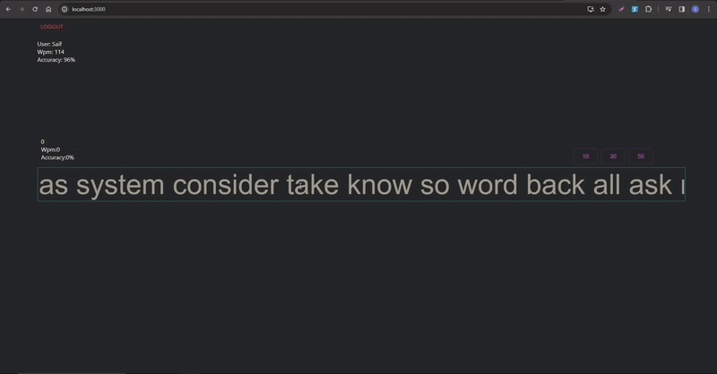

*Still documenting

# Typing practice website

The Typing Website is an interactive platform designed to help users enhance their typing skills while providing personalized progress tracking. It offers a seamless and engaging typing experience, focusing on improving typing speed and accuracy. 

This platform allows users to create accounts and log in to access personalized features. Upon login, users can track their typing progress, including average typing speed and accuracy, which is saved and associated with their account. The website provides real-time Words Per Minute (WPM) updates, enabling users to gauge their typing speed as they practice.

## Features

- **User Authentication:** Secure account creation and login functionality using Spring Boot security.
- **Login Functionality:** Log in securely to access your saved data and settings.
- **Progress Tracking:** Save and track your average typing speed and accuracy over time.
- **Live WPM Display:** Get real-time Words Per Minute updates while typing.

### Authorization Note

**Note:** GitHub Pages supports static websites and does not support server-side processing or authorization. As a result, certain features requiring authorization may not function when accessed through the GitHub Pages deployment.

To fully experience all features, consider running the website locally.

## Demo

https://ullahs5.github.io/typing-practice/

## Setup
### Backend (Spring Boot)
1. You need Docker Desktop to set up a postgres instance in your local environment.
2. Configure your jdk.
3. Run the docker-compose.yml, use a new port if the current one already exists.
4. Run the Main application under the demo folder. 

### Frontend (React.js)
1. Run 'npm start' in the terminal. Make sure you're in the 'frontend' directory where 'package.json' is apparent. 

## Roadmap

-

